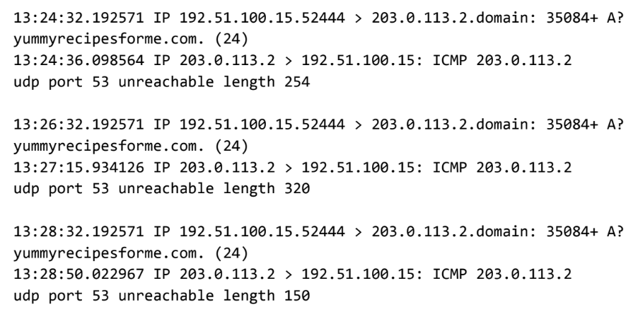

# Analyser la communication de la couche réseau

# Scénario
Vous êtes analyste en cybersécurité dans une entreprise spécialisée dans la fourniture de services informatiques pour des clients. Plusieurs clients ont signalé qu’ils n’étaient pas en mesure d’accéder au site web de l’un de vos clients, www.yummyrecipesforme.com, et qu’ils voyaient le message d’erreur « destination port unreachable » après avoir attendu le chargement de la page.

Vous êtes chargé d’analyser la situation et de déterminer quel protocole réseau a été affecté lors de cet incident. Pour commencer, vous tentez de visiter le site web vous-même et vous recevez également l’erreur « destination port unreachable ».

Pour résoudre le problème, vous chargez votre outil d’analyse réseau, tcpdump, et vous essayez à nouveau de charger la page. Pour charger la page web, votre navigateur envoie une requête à un serveur DNS via le protocole UDP afin d’obtenir l’adresse IP associée au nom de domaine du site ; cela fait partie du fonctionnement du protocole DNS.

Votre navigateur utilise ensuite cette adresse IP comme adresse IP de destination pour envoyer une requête HTTPS au serveur web afin d’afficher la page.

L’analyseur réseau montre que lorsque vous envoyez des paquets UDP au serveur DNS, vous recevez des paquets ICMP contenant le message d’erreur : « udp port 53 unreachable ».

Dans le journal tcpdump, vous trouvez les informations suivantes :

1. Les deux premières lignes du fichier journal affichent la requête initiale sortante envoyée par votre ordinateur au serveur DNS pour demander l’adresse IP de yummyrecipesforme.com. Cette requête est transmise dans un paquet UDP.

2. Les troisième et quatrième lignes du journal montrent la réponse à votre paquet UDP. Dans ce cas, la ligne commençant par ICMP 203.0.113.2 est le début du message d’erreur indiquant que le paquet UDP n’a pas pu être livré au port 53 du serveur DNS.

3. Devant chaque requête et chaque réponse, vous trouvez des horodatages indiquant le moment exact où l’incident s’est produit. Dans le journal, c’est la première séquence de chiffres affichée : 13:24:32.192571. Cela signifie que l’heure est 13h24 et 32,192571 secondes.

4. Après les horodatages, vous trouverez les adresses IP source et destination. Sur la première ligne, où le paquet UDP est envoyé depuis votre navigateur vers le serveur DNS, cette information est affichée comme suit :
192.51.100.15 > 203.0.113.2.domain
L’adresse IP à gauche du symbole > est l’adresse source — dans cet exemple, celle de votre ordinateur. L’adresse à droite est l’adresse de destination, ici celle du serveur DNS : 203.0.113.2.domain.
Dans le cas de la réponse ICMP contenant l’erreur, l’adresse source est 203.0.113.2, et l’adresse destination est l’IP de votre ordinateur : 192.51.100.15.

5. Après les adresses IP source et destination, d’autres informations peuvent apparaître, comme le protocole, le numéro de port source, et divers indicateurs (flags). Sur la première ligne du journal d’erreur, le numéro d’identification de la requête est : 35084. Le signe plus (+) après ce numéro indique qu’il y a des drapeaux (flags) associés au message UDP. Le champ "A?" indique une requête DNS de type A, utilisée pour obtenir l’adresse IP associée à un nom de domaine.
La troisième ligne affiche le protocole utilisé pour le message de réponse : ICMP, suivi d’un message d’erreur ICMP.

6. Le message d’erreur "udp port 53 unreachable" est indiqué dans la dernière ligne. Le port 53 est le port utilisé pour le service DNS. Le mot "unreachable" signifie que le message UDP, qui demandait l’adresse IP du domaine www.yummyrecipesforme.com, n’a pas pu atteindre le serveur DNS car aucun service n’était actif sur le port 53.

7. Les lignes restantes du journal indiquent que des paquets ICMP ont été envoyés deux fois supplémentaires, mais le même message d’erreur de livraison a été reçu à chaque tentative.

Maintenant que vous avez capturé les paquets de données avec un outil d’analyse réseau, votre mission consiste à identifier le protocole réseau et le service affectés par l’incident.Ensuite vous devrez rédigé un rapport de suivi pour en informer votre superviseur.

# Résumé du problème détecté dans le journal de trafic DNS et ICMP
L'analyseur de protocole réseau renvoie une erreur indiquant que le port UDP 53 est inaccessible lors d'une tentative d'accès au site "yummyrecipesforme.com".
Le port 53 est normalement utilisé pour le protocole DNS. Cela suggère qu’il est soit bloqué, soit hors service.

# Analyse des données
L'incident s’est produit à 13h24. Plusieurs clients ont signalé qu’ils n’étaient pas en mesure d’accéder au site web "www.yummyrecipesforme.com", et qu’ils voyaient le message d’erreur « Destination port unreachable ».

Lors de notre investigation, nous avons observé un message d’erreur indiquant que le port 53 est inaccessible. Cela suggère que ce port est soit bloqué, soit hors service.

La prochaine étape consisterait à vérifier si :
- les serveurs DNS sont réellement à l’arrêt
- si le trafic vers le port 53 est bloqué par un pare-feu.