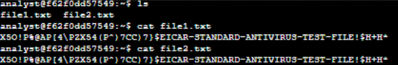
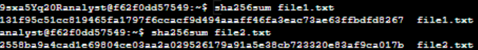
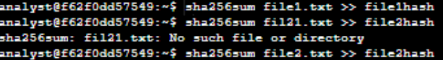
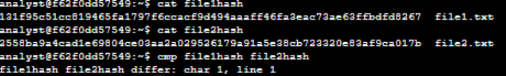

# Comparer les valeurs de Hash
## Description

En tant qu’analyste en cybersécurité, l’un des contrôles de sécurité que nous pouvons mettre en place est le hachage. Ce procédé génère un code qui ne peut pas être déchiffré. Il permet d’identifier de manière unique le contenu d’un fichier, ce que l’on appelle une empreinte numérique ou valeur de hachage. Par exemple, un programme malveillant peut imiter un programme légitime. Toutefois, si une seule ligne de code diffère du programme original, la valeur de hachage générée sera différente. Les équipes de sécurité peuvent ainsi détecter le programme malveillant et prendre des mesures pour réduire le risque.

## Génération des haches

Tout d’abord, la commande `ls` permet d’afficher les fichiers présents dans le répertoire. On remarque qu’il y a deux fichiers et nous souhaitons consulter leur contenu à l’aide de la commande `cat`. Comme on peut le voir ci-dessous, le contenu des deux fichiers semble identique.

Pour vérifier s’ils sont réellement différents ou non, nous utilisons la commande `sha256`. Le résultat montre que les deux fichiers possèdent des valeurs de hachage différentes.

## Comparaison des fichiers hachés

Générons ensuite la valeur de hachage de `file1.txt` et de `file2.txt` dans deux nouveaux fichiers distincts, nommés respectivement `file1hash` et `file2hash`.

À l’aide de la commande `cat`, nous pouvons inspecter leur contenu. Enfin, pour comparer directement les deux fichiers, on utilise la commande `cmp`.

Nous pouvons finalement voir que les deux fichier dont bien différents
