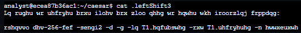

# Scénario

Dans ce scénario, tous les fichiers de votre répertoire personnel ont été cryptés. Vous devrez utiliser des commandes Linux pour casser le chiffre de César et décrypter les fichiers afin de pouvoir lire les messages cachés qu'ils contiennent.

Voici comment vous allez procéder : vous allez d'abord explorer le contenu du répertoire personnel et lire le contenu d'un fichier.Ensuite, vous allez trouver un fichier caché et décrypter le chiffre de César qu'il contient.Enfin, vous allez décrypter le fichier de données crypté pour récupérer vos données et révéler le message caché.

# Exercice

### 1. Lire le contenu d’un fichier

J'ai utiliser la commande `ls` pour lister les fichiers dans le répertoire : `ls /home/analyst`

Deux fichiers `Q1.encrypted` et `README.txt` ainsi qu'un sous-répertoire `caesar`, sont répertoriés :

Dans un premier temps, j'ai decidé de lire le fichier `README.txt` avec la commande `cat README.txt`

Le message dans le fichier README.txt indique que le sous-répertoire caesar contient un fichier caché.

### 2. Trouver le fichier caché

Dans un premier temps je me suis rendu dans le fichier `ceasar` et j'ai ensuite listé les fichiers caché avec `ls -a`
indiquant en effet un fichier caché nomée `leftShift3` 

je l'ai ensuite ouvert avec la commande `cat .leftShift3`

Le fichier est actuellement illisible mais au nom du dossier qui le contients ainsi que sont apparence j'ai tres vite compris qu'il sagissait d'un chiffrement César. Ce chiffrement peut être résolu en décalant chaque caractère de l'alphabet vers la gauche ou la droite d'un nombre fixe d'espaces.

> Ne trouvant pas la solution proposée pour l’exercice satisfaisante, se limitant à utiliser une commande Bash décalant automatiquement les caractères au bon endroit : `(cat .leftShift3 | tr "d-za-cD-ZA-C" "a-zA-Z")`.

> J’ai choisi de créer mon propre décripteur César en projet personnel, permettant de déchiffrer moi-même le code. Vous pouvez retrouver ce programme sous le nom `CeasarDecrypt.py` sur mon GitHub.
 

 

 ###  3. Decrypter un fichier

 Maintenant que le texte est déchiffré il ne me reste plus qu'à retourner au répertoire de travail initial et à exécute la commande pour déchiffrer le fichier :

 `openssl aes-256-cbc -pbkdf2 -a -d -in Q1.encrypted -out Q1.recovered -k ettubrute`

Cette commande inverse le chiffrement du fichier avec un chiffrement symétrique sécurisé, comme indiqué par AES-256-CBC. L’option -pbkdf2 est utilisée pour ajouter une sécurité supplémentaire à la clé, et -a indique le codage souhaité pour la sortie. L’option -d signifie que je déchiffre le fichier, -in spécifie le fichier d’entrée et -out spécifie le fichier de sortie. L’option -k indique le mot de passe, qui dans cet exemple est ettubrute.

Ensuite, j’utilise la commande ls puis cat Q1.recovered.

