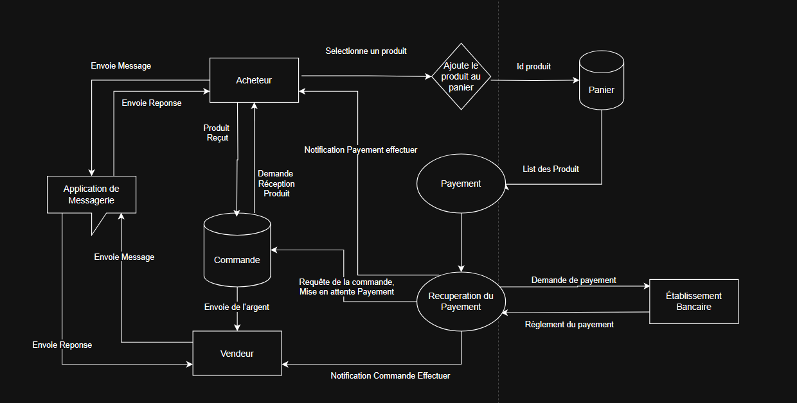
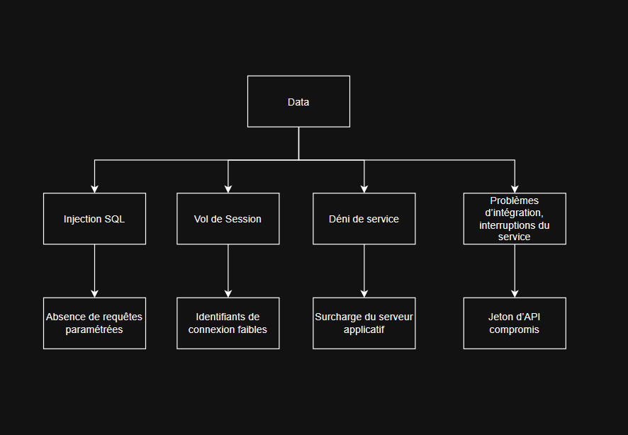

# PASTA Model Framework
> PASTA : Processs of Attack Simulation and Threat Analysis

## Scénario

Vous faites partie de l'équipe de sécurité grandissante d'une entreprise spécialisée dans les sneakers pour les passionnés et les collectionneurs. L'entreprise prépare le lancement d'une application mobile facilitant l'achat et la vente de chaussures pour ses clients.

Vous allez réaliser une analyse des risques de l'application en utilisant la méthodologie PASTA. Vous passerez en revue chacune des sept étapes de cette méthodologie afin d'identifier les exigences de sécurité pour la nouvelle application de l'entreprise.

## Composants de la méthodologie PASTA

- Définir les objectifs métier et de sécurité
- Définir le périmètre technique
- Décomposer l’application (diagramme de flux de données)
- Analyse des menaces
- Analyse des vulnérabilités
- Modélisation des attaques (arbre d’attaque)
- Analyse des risques et impact

# Implémentation
## I. Définir les objectifs métier et de sécurité

----------------------------------------------
| Objectifs métier | Objectif de Sécurité |
| :---: | :---: | 
| Création et Connection au compte simple et rapide |  Plusieur moyen de connection, Multi facteur Authentification, Filtre Anti-Bot, connection sécurisé|
| Plusieur Moyen de  payement | Payement sécurisé, Suivre la norme PCI-DSS, Enregistrer moyen de payement| 
| Possibilité de contacter le vendeur | Messagerie sécurisé, Anonymat, Signalement de message|
| Rechercher et Ajouter des produit au panier | Enregistrer et mettre à jour le panier et le catalogue |
---------------

## II. Définir le périmètre technique

- API de l'application
- Public key infrastructure (PKI) 
- Base de Donnée

## III. Décomposer l’application (diagramme de flux de données)

Data Flow Diagram : 

## IV. Analyse des menaces
- Injection SQL
- usurpation de session
- Déni de service (DoS)
- Problèmes d’intégration, interruptions du service

## V. Analyse des vulnérabilités

- Absence de requêtes paramétrées
- Identifiants de connexion faibles
- Surcharge du serveur applicatif
- Jeton d’API compromis

## VI. Modélisation des attaques

Arbre d’attaque :

## VII. Analyse des risques et impact
- Hachage SHA-256
- Procédures de réponse aux incidents
- Guide opérationnel (politique de sécurité)
- Politique de mot de passe
- Principe du moindre privilège
- Modèle Zero Trust 