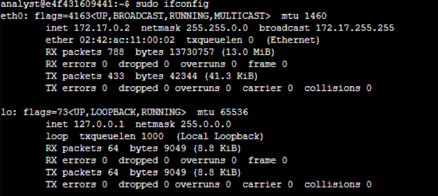
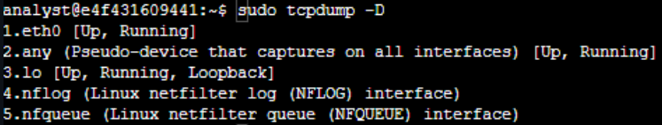
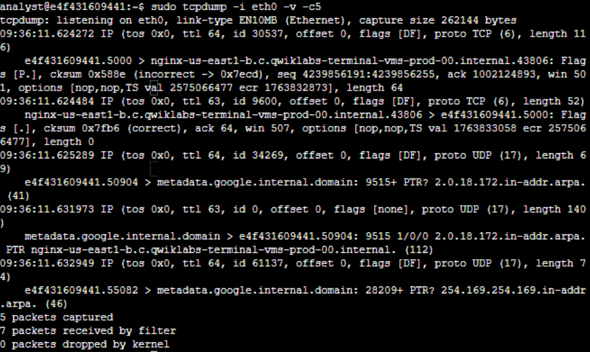
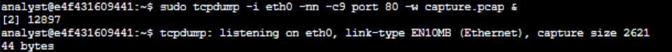
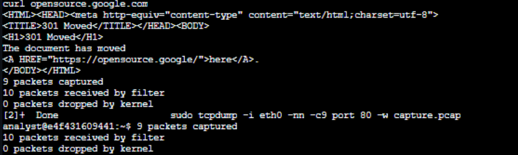
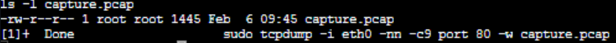
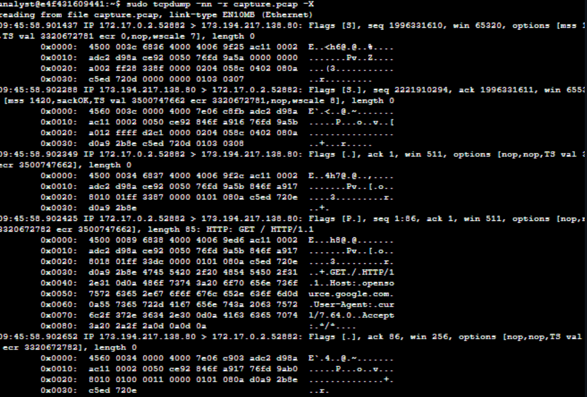
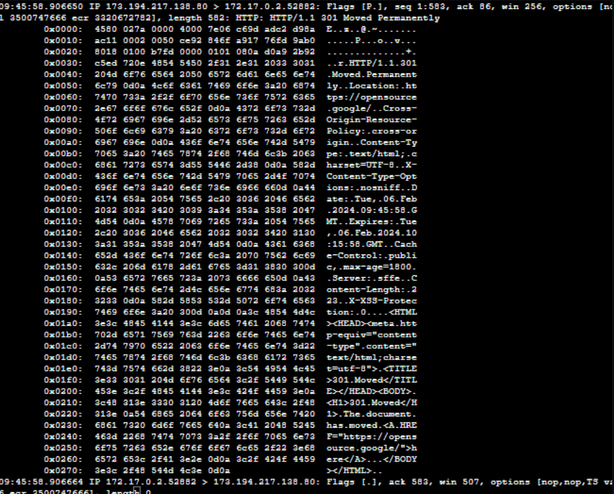

# Tcpdump - Capture ton premier packet
## Scénario 

Vous êtes un analyste réseau et vous devez utiliser tcpdump pour capturer et analyser le trafic réseau en direct depuis une machine virtuelle Linux.

Le laboratoire commence avec votre compte utilisateur, appelé analyst, déjà connecté à un terminal Linux.

Le répertoire personnel de votre utilisateur Linux contient un fichier d’exemple de capture de paquets que vous utiliserez à la fin du laboratoire pour répondre à quelques questions sur le trafic réseau qu’il contient.

Voici comment vous allez procéder :

Identifier les interfaces réseau afin de capturer les données des paquets réseau.

Utiliser tcpdump pour filtrer le trafic réseau en direct.

Capturer le trafic réseau à l’aide de tcpdump.

Enfin, filtrer les données de paquets capturées.

## Procédure

  Dans un premier temps j'ai voulus identifier les interface résaux disponible sur le resaux que je pouvais scanner avec tcpdump pour cela j'ai d'abord utiliser `sudo ifconfig` puis `sudo tcpdump -D`, l'argument -D permet de lister les interface disponible sur tcpdump

on retrouve les interface suivante : 

>`eth0` : Interface Ethernet

>`lo :` Interface locale  

>`any :` Permet d'ecouter toute les interfaces disponible  

>`nflog :` Interface lié au Framework **Netfilter**, capture le trafic envoyé par iptables/nftables  

>`nfqueue :` Aussi liée à **Netfilter** permet d’envoyer les paquets dans une file (queue) souvent pour une inspection par IDS/IPS.

Etant donné que je souhaite pas scanner le trafic de Netfilter ni le trafic local j'ai opter pour le trafic ethernet.
pour cela j'ai utiliser la commande `sudo tcpdump -i eth0 -v -c5`

>`-i :` permet de spécifier l'interface choisis (dans notre cas eth0)  

>`-v :` v pour Verbose. Affiche plus de details sur les packets filtré  

>`-c :` c pour count. Affiche les X premier packet et arrete de scanner ensuite (dans notre cas les 5 premier packets)

Ils nous est demander par la suite de Capturer des paquets dans un fichier nommé `capture.pcap`  pour cela j'utilise la commande `sudo tcpdump -i eth0 -nn -c9 port 80 -w capture.pcap &`

>`-nn` : force la commande a ne pas tenter de résoudre les adresses IP ou les ports en noms. C’est une bonne pratique du point de vue de la sécurité, car les données de résolution peuvent ne pas être valides. Cela empêche également des acteurs malveillants d’être alertés d’une enquête.

>`port 80` : Filtrer uniquement le trafic du port 80. Il s’agit du port HTTP par défaut.

>`-w capture.pcap` : Enregistrer les données capturées dans le fichier indiqué.

>`& `: Instruction pour l’interpréteur de commandes Bash afin d’exécuter la commande en arrière-plan.

Pendant la duré du scan j'utilise la commande curl `opensource.google.com` pour generer du trafic HTTP (TCP port 80)

je vérifie par la suite que le document s'est bien généré 
et par la suite 

et ensuite je veut lire le packet TCP du fichier que je viens d'enregistrer avec la commande `sudo tcpdump -nn -r capture.pcap -X`

>`-r` : Lis les données capturées à partir du fichier spécifié.

>`-X `: Affiche les données des paquets à la fois en format hexadécimal et ASCII. Les analystes en sécurité peuvent analyser la sortie hexadécimale et ASCII pour détecter des motifs ou des anomalies lors d’analyses de logiciels malveillants ou d’analyses forensiques.

