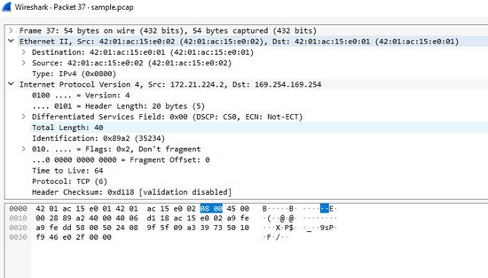

# Scénario

Vous êtes un analyste en sécurité en train d’enquêter sur le trafic vers un site web.

Vous allez analyser un fichier de capture de paquets réseau contenant des données de trafic liées à la connexion d’un utilisateur à un site Internet. La capacité à filtrer le trafic réseau à l’aide d’outils de capture (packet sniffers) afin de recueillir des informations pertinentes est une compétence essentielle pour un analyste en sécurité.

Vous devez filtrer les données afin de :

- Identifier les adresses IP source et destination impliquées dans cette session de navigation web.

- Examiner les protocoles utilisés lorsque l’utilisateur se connecte au site web.

- Analyser les paquets de données pour identifier le type d’informations envoyées et reçues par les systèmes lors de la capture du trafic réseau.

Aperçu des colonnes principales listées pour chaque paquet :

- `No `: Le numéro d’index du paquet dans ce fichier de capture.

- `Time `: L’horodatage du paquet.

- `Source `: L’adresse IP source.

- `Destination` : L’adresse IP de destination.

- `Protocol` : Le protocole contenu dans le paquet.

- `Length` : La taille totale du paquet.

- `Info `: Quelques informations sur les données contenues dans le paquet (la charge utile), interprétées par Wireshark.

## Procédure

### Identifier les adresses IP source et destination impliquées dans cette session de navigation web.

Dans la barre de filtrage j'ai inscrit `ip.addr == 142.250.1.139` afin de filtrer le trafic associé à une adresse IP spécifique. 
Sélectionnez ensuite le premier paquet qui contient `TCP` dans le champ Info. 
Le champ `addr`  signifie soit l’adresse source, soit l’adresse de destination.

Dans la barre de filtrage, tapez `ip.src == 142.250.1.139` pour filtrer le trafic associé à une adresse IP spécifique. `src` signifie qu’il s’agit de l’adresse d’où provient le paquet.

Dans la barre de filtrage, tapez `ip.dst == 142.250.1.139` pour filtrer le trafic associé à une adresse IP spécifique. `dst` signifie l’endroit où va le paquet.

Dans la barre de filtrage, tapez `eth.addr == 42:01:ac:15:e0:02` pour filtrer le trafic associé à une adresse MAC Ethernet spécifique.

###  Examiner les protocoles utilisés lorsque l’utilisateur se connecte au site web

Le port de destination TCP de ce paquet est 80 lorsque `ip.addr == 142.250.1.139`, ce qui contient la requête initiale vers un site web HTTP qui écoute généralement sur le port TCP 80.

Le port de destination du protocole est TCP lorsque l’adresse Ethernet est `42:01:ac:15:e0:02`. L’adresse source est `172.21.224.2` et l’adresse de destination est `35.235.244.34`.

### Analyser le paquet de données pour identifier le type d’informations envoyées et reçues par les systèmes lorsque le trafic réseau est capturé 

Dans la barre de filtrage, tapez `tcp.port == 80 `pour filtrer le trafic associé à un numéro de port spécifique. `tcp.port == 80` signifie que seuls les paquets TCP sur le port 80 seront affichés.

Lorsque le filtre `tcp.port == 80` est appliqué, la valeur Time to Live est 64.

`Time to Live (TTL)` : un champ de l’en-tête IP qui indique le temps maximal pendant lequel un paquet IP est autorisé à exister dans le réseau avant d’être supprimé s’il n’a pas atteint sa destination. Le TTL est utilisé pour éviter que les paquets ne circulent indéfiniment dans le réseau, ce qui pourrait arriver en cas de boucle de routage. Il peut être utilisé comme mesure de sécurité de base pour limiter la propagation des paquets dans le réseau.

Lorsque le filtre `tcp.port == 80` est appliqué, le numéro de trame est 37 et la taille de trame est de 54 octets.

`Numéro de trame` : c’est essentiellement le numéro de séquence d’un paquet dans une capture particulière. Il permet d’identifier et de référencer plus facilement les paquets. Dans ce cas, un numéro de trame de 37 signifie qu’il s’agit du 37e paquet capturé depuis le début de la session de capture. Ce numéro est attribué séquentiellement à mesure que les paquets sont capturés, en commençant par 1 pour le premier paquet.

`Taille de trame `: cela indique la taille totale du paquet, y compris tous les en-têtes et la charge utile, mesurée en octets. Une taille de trame de 54 octets signifie que la taille totale du paquet est de 54 octets. Cette taille inclut tout, de la couche la plus basse (couche physique) jusqu’à la couche la plus haute présente dans le paquet que Wireshark peut décoder. C’est utile pour comprendre la taille des données transmises et peut aider à différentes analyses, comme l’identification de problèmes potentiels de fragmentation ou d’autres anomalies.

