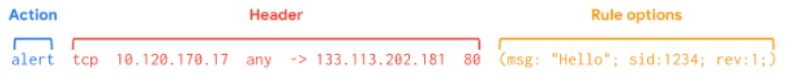
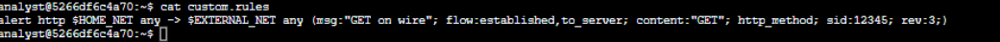
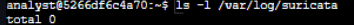
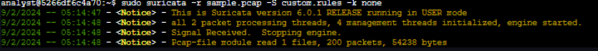
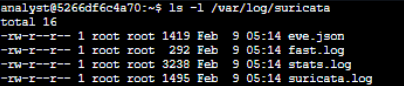
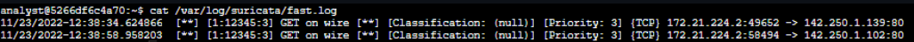
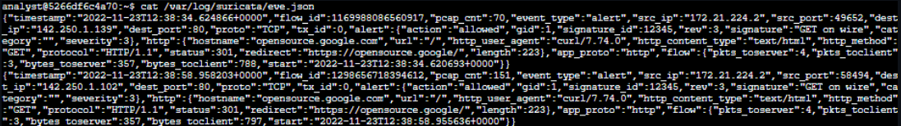
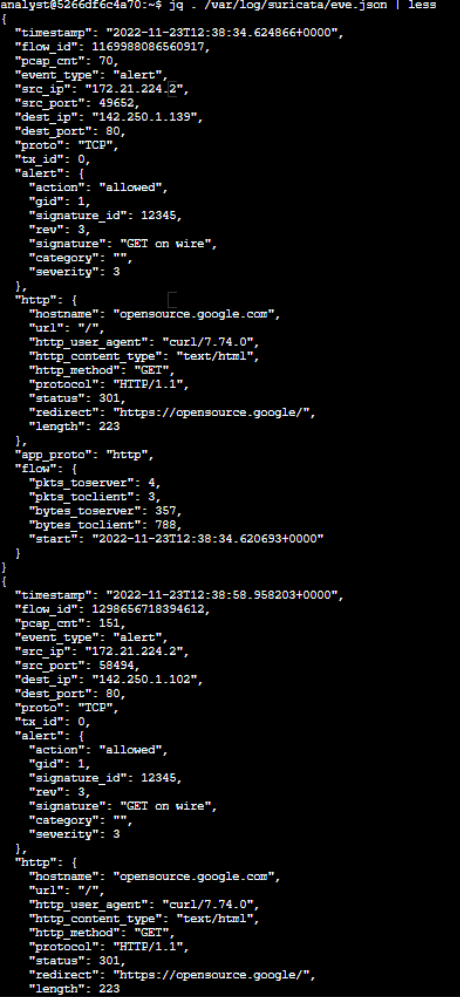
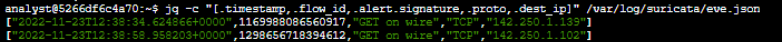

# Systèmes de détection d’intrusion (IDS) - Suricata

>Suricata est un système de détection d’intrusion (IDS), de prévention d’intrusion (IPS) et un outil d’analyse réseau open-source.

>Un système de détection d’intrusion (IDS) est une application qui surveille l’activité d’un système et alerte en cas d’intrusions possibles. Les technologies IDS aident les organisations à surveiller l’activité de leurs systèmes et réseaux afin d’identifier des signes d’activités malveillantes.

## Vue d’ensemble

Il existe trois manières d’utiliser Suricata :

- Système de détection d’intrusion (IDS) : Surveiller le trafic réseau et alerter sur les activités et intrusions suspectes. De façon pratique, il peut s’agir d’un IDS basé sur l’hôte pour surveiller les activités système et réseau d’une seule machine comme un ordinateur.

- Système de prévention d’intrusion (IPS) : Détecter et bloquer les activités et trafics malveillants. Cela nécessite une configuration supplémentaire comme l’activation du mode IPS.

- Surveillance de la sécurité réseau (NSM) : Produire et enregistrer des journaux réseau pertinents (trafic en direct, fichiers de capture de paquets existants, captures complètes ou conditionnelles de paquets). C’est utile pour la criminalistique, la réponse aux incidents et pour tester des signatures.

Suricata utilise l’analyse par signatures, une méthode de détection permettant d’identifier des événements d’intérêt. Les signatures sont composées de trois éléments :

- Action : Première composante d’une signature. Elle décrit l’action à entreprendre si l’activité réseau ou système correspond à la signature. Exemples : alert, pass, drop ou reject.

- En-tête : Inclut des informations sur le trafic réseau comme les adresses IP source et destination, les ports source et destination, le protocole et la direction du trafic

- Options de règle : Offrent diverses possibilités pour personnaliser les signatures.




## Scénario

Vous êtes analyste sécurité et devez surveiller le trafic du réseau de votre employeur. Vous serez amené à configurer Suricata et à l’utiliser pour déclencher des alertes.

Voici comment vous allez réaliser cette tâche : d’abord, vous explorerez des règles personnalisées dans Suricata. Ensuite, vous exécuterez Suricata avec une règle personnalisée afin de la déclencher et vous examinerez les journaux de sortie dans le fichier fast.log. Enfin, vous examinerez les sorties supplémentaires que Suricata génère dans le fichier journal standard eve.json.

Aux fins des tests que vous effectuerez dans cette activité de laboratoire, un fichier sample.pcap et un fichier custom.rules vous ont été fournis. Ceux-ci se trouvent dans votre dossier personnel.

Définissons les fichiers :

- `Sample.pcap` est un fichier de capture de paquets qui contient un exemple de données de trafic réseau, que vous utiliserez pour tester les règles Suricata. Cela vous permettra de simuler et de répéter l’exercice de surveillance du trafic réseau.

- `Custom.rules` contient une règle personnalisée au début de l’activité. Vous ajouterez des règles à ce fichier et vous les exécuterez sur les données de trafic réseau contenues dans le fichier `sample.pcap`.

- `Fast.log` contiendra les alertes générées par Suricata. Le fichier fast.log est vide au démarrage du laboratoire. Chaque fois que vous testez une règle, ou un ensemble de règles, sur les données de trafic réseau simulées, Suricata ajoute une nouvelle ligne d’alerte dans le fichier fast.log lorsque toutes les conditions de l’une des règles sont remplies. Le fichier fast.log se trouve dans le répertoire `/var/log/suricata` après l’exécution de Suricata. Le format **fast.log est considéré comme obsolète** et n’est **pas recommandé pour les tâches de réponse aux incidents ou de recherche de menaces**, mais il peut être utilisé pour des vérifications rapides ou des tâches liées à l’assurance qualité.

- `Eve.json` est le fichier journal principal, standard et par défaut pour les événements générés par Suricata. Il contient des informations détaillées sur les alertes déclenchées, ainsi que d’autres événements de télémétrie réseau, au format JSON. Le fichier eve.json est généré lorsque Suricata s’exécute, et se trouve également dans le répertoire `/var/log/suricata`.

Lorsque vous créez une nouvelle règle, vous devrez la tester pour confirmer si elle a fonctionné comme prévu ou non. Vous pouvez utiliser le fichier `fast.log` pour comparer rapidement le nombre d’alertes générées à chaque exécution de Suricata afin de tester une signature contre le fichier `sample.pcap`.

 ## Attentes

Créer des règles personnalisées et les exécuter dans Suricata

Surveiller le trafic capturé dans un fichier pcap

Examiner les sorties dans fast.log et eve.json


### Examiner une règle personnalisée dans Suricata



```
alert http $HOME_NET any -> $EXTERNAL_NET any (msg:"GET on wire"; flow:established,to_server; content:"GET"; http_method; sid:12345; rev:3;)
```

- Action `Alert` : Indique de déclencher une alerte sur un trafic réseau spécifique. L’IDS inspecte les paquets et envoie une alerte si ça correspond.

- En-tête `http` : La règle s’applique uniquement au trafic HTTP. La flèche indique la direction du trafic depuis $HOME_NET vers $EXTERNAL_NET. Ici, $HOME_NET est défini dans `/etc/suricata/suricata.yaml` comme le sous-réseau `172.21.224.0/20`.

- Les règles custom :

    - `msg:` le texte affiché dans l’alerte sera `GET on wire`.

    - `flow:established,to_server:` correspond aux paquets envoyés du client vers le serveur (connexion déjà établie).

    - `content:"GET"` : Suricata doit chercher le mot GET dans la méthode HTTP.

    - `sid:12345 `: identifiant unique de la règle.

    - `rev:3` : numéro de version de la signature.

 ### Déclencher une règle personnalisée dans Suricata

Lister les fichiers dans le dossier `/var/log/suricata` (avant cet étape, il est vide) :



On exécute Suricata en utilisant `custom.rules` et `sample.pcap`

 - `-r sample.pcap` spécifie un fichier d’entrée pour simuler du trafic réseau. Dans ce cas, le fichier sample.pcap.

 - `-S custom.rules` indique à Suricata d’utiliser les règles définies dans le fichier custom.rules.

 - `-k none` indique à Suricata de désactiver toutes les vérifications de checksum.

 

On liste à nouveau les fichiers dans le dossier /var/log/suricata:



Maintenant on lis le Fichier  `fast.log ` :



Ici, chaque ligne correspond à une alerte générée par Suricata lorsqu’il traite un paquet qui correspond aux conditions d’une règle déclenchant une alerte. Chaque ligne contient la règle qui a généré l’alerte, l’adresse source, la destination et la direction du trafic.

 ### Examiner la sortie eve.json



C'est pas très lisible donc affichons le ficher dans un format facilement lisible



Ils y a trop d'information et peut d'entre elle sont utile, Filtrons les donnée de sortie importante 




Plusieurs éléments peuvent être trouvés dans le fichier eve.json :

- La valeur de severity pour la première alerte renvoyée par la commande `jq` est 3.

- L’adresse IP de destination listée pour le dernier événement est `142.250.1.102`.

- La signature d’alerte pour la première entrée est `GET on WIRE`.