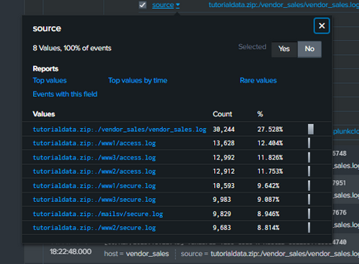

# Siem - Splunk
>Splunk est une plateforme qui aide les organisations à prévenir les problèmes majeurs, identifier les menaces, restaurer les services et accélérer leur transformation grâce à la visibilité et aux informations dont elles ont besoin.

# Aperçu

Un SIEM (Security Information and Event Management), comme Splunk, est un élément essentiel de la boîte à outils d’un analyste en cybersécurité, car il offre une plateforme pour stocker, analyser et rapporter des données provenant de différentes sources.

Le langage de requête de Splunk, appelé Search Processing Language (SPL), utilise notamment des pipes `|` et des wildcards. Une recherche efficace permet d’identifier rapidement des modèles, tendances et anomalies dans les données.

# Scénario

Vous êtes analyste en cybersécurité pour la boutique en ligne Buttercup Games.
Votre mission consiste à identifier d’éventuels problèmes de sécurité sur le serveur de messagerie.
Pour cela, vous devez examiner les connexions SSH échouées pour le compte root.

Les données contenues dans `tutorialdata.zip` que vous allez téléverser dans Splunk comportent les éléments suivants :

- `mailsv` – le serveur de messagerie de Buttercup Games. Vous devez examiner les événements générés par cet hôte.
- `www1` – l’une des applications web de Buttercup Games.
- `www2` – une autre application web de Buttercup Games.
- `www3` – une autre application web de Buttercup Games
- `vendor_sales` – des informations sur les ventes au détail de Buttercup Games.

## Procédure

>Les outils SIEM collectent et traitent les données afin qu’elles deviennent des événements consultables pouvant être interrogés, visualisés et analysés.

> Visiter ce <a href="https://drive.google.com/file/d/1nDz_DZB4ADbD4tvaDa54_l1FoT_jtVy4/view">lien</a> pour télécharcher `tutorialdata.zip`

Une fois le fichier de donnée importé, j'ai commencer ma recherche avec `index=main ` pour afficher les données et sélectionné `All time` afin de visualiser tous les événements sur toute la période.

> Sur splunk on peut ajuster la période à l’aide du menu déroulant time range ou des modificateurs de temps. Une plage plus courte renvoie les résultats plus rapidement et utilise moins de ressources.

Jetons un coup d’œil aux trois composants courants : host, source, sourcetype.

>Host : Spécifie l’appareil ou le système qui a généré l’événement.

>Source : Indique l’emplacement d’origine des données de l’événement au sein d’un appareil ou d’un système spécifique.

>Sourcetype : Définit le format et la structure des données de l’événement. Il indique à Splunk comment analyser et interpréter les informations.

Sur le serveur de messagerie, je dois explorer les connexions SSH échouées pour le compte root. Pour ce faire, j’ai recherché `index=main host=mailsv` afin de répertorier plus de 9000 événements générés par le serveur de messagerie.

Enfin, j'ai recherché une connexion échouée pour root avec `index=main host=mailsv fail* root`.Cela indique à Splunk d’étendre le terme de recherche pour trouver d’autres termes contenant le mot fail, tels que failure, failed, etc. De plus, le mot-clé root recherche tout événement contenant le terme root.

## Résultats
Il y a plus de 100 000 événements contenus dans l’index principal sur toute la période.

Au 11 février 2024, il y a eu 346 connexions SSH échouées pour le compte root sur le serveur de messagerie.