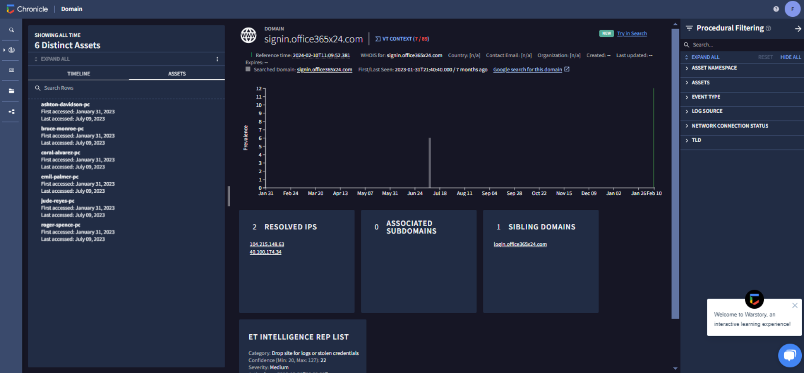
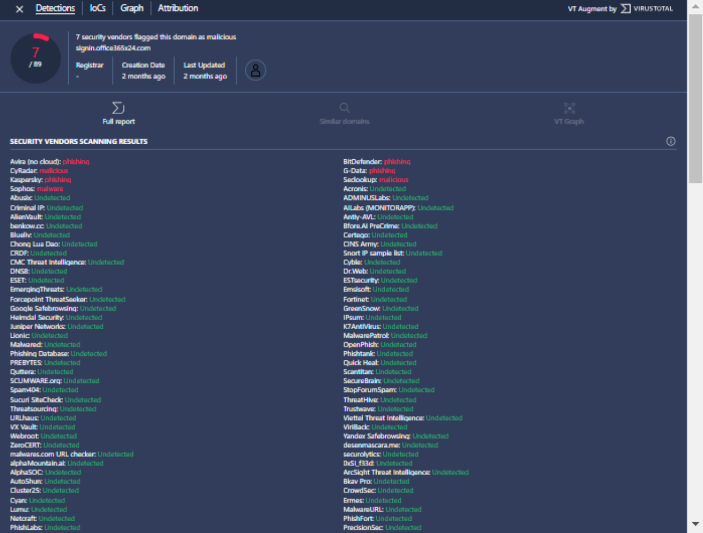
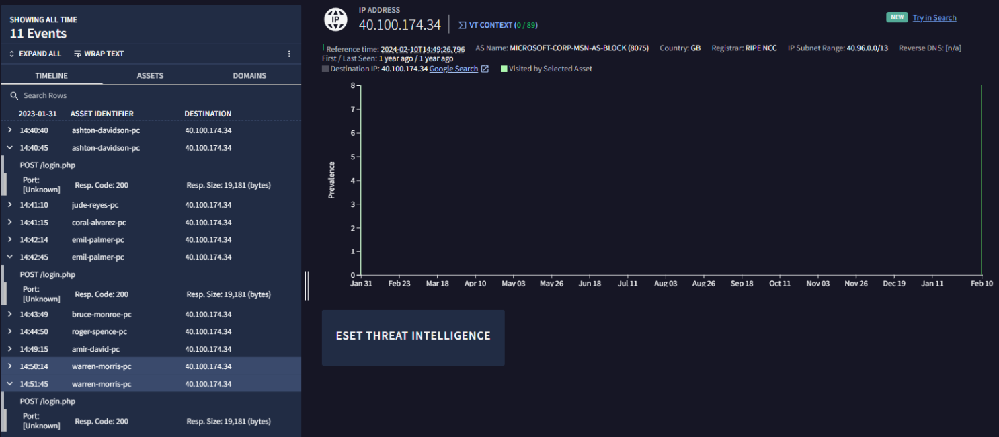

# SIEM Chronicle

>Un SIEM (Security Information and Event Management), comme Chronicle, est un élément essentiel de la boîte à outils d’un analyste en cybersécurité, car il offre une plateforme pour stocker, analyser et rapporter des données provenant de différentes sources.

>Chronicle est un service cloud, conçu comme une couche spécialisée au-dessus de l’infrastructure principale de Google, destinée aux entreprises pour conserver, analyser et rechercher en toute confidentialité les énormes volumes de télémétrie de sécurité et de réseau qu’elles génèrent.

## Aperçu

Dans Chronicle, nous pouvons rechercher des événements à l’aide du champ Search. Le `Procedural Filtering` applique des filtres à une recherche afin d’affiner davantage les résultats. Par exemple, vous pouvez l' utiliser pour inclure ou exclure des résultats contenant des informations spécifiques liées à un type d’événement ou à une source de journal.

De plus, `YARA-L` est un langage informatique utilisé pour créer des règles permettant de rechercher dans les données de journaux ingérées. Il existe deux types : `Unified Data Mode` ou `Raw Log Search`.

-  `Unified Data Mode (UDM)` est le type de recherche par défaut utilisé dans Chronicle. Grâce à une recherche UDM, Chronicle recherche les données de sécurité qui ont été ingérées, analysées et normalisées. Cette recherche renvoie des résultats plus rapidement qu’une recherche brute (Raw Log Search) en raison des données indexées et structurées dans UDM.

- `Raw Log Search` permet de rechercher dans les journaux bruts non analysés. Elle parcourt les journaux bruts, ce qui la rend plus lente que l’UDM. Ici, nous pouvons spécifier des informations telles que les noms d’utilisateur, les noms de fichiers, les hachages, etc. Elle prend également en charge l’utilisation d’expressions régulières pour restreindre la recherche à des correspondances de modèles spécifiques.

## Scénario

Vous êtes analyste en cybersécurité dans une entreprise de services financiers. Vous recevez une alerte indiquant qu’un employé a reçu un email de phishing dans sa boîte de réception. Vous examinez l’alerte et identifiez un nom de domaine suspect contenu dans le corps de l’email :
signin.office365x24.com

Vous devez déterminer si d’autres employés ont reçu des emails de phishing contenant ce domaine et s’ils ont visité ce domaine. Vous allez utiliser Chronicle pour enquêter sur ce domaine.

## Attentes

- Accéder aux rapports de renseignement sur les menaces concernant le domaine

- Identifier les actifs ayant accédé au domaine

- Évaluer les événements HTTP associés au domaine

- Identifier quels actifs ont soumis des informations de connexion au domaine

- Identifier d’autres domaines

## Procédure

J'ai d'abbord commencer par effectuer une recherche sur le nom de domaine suspect, pour cela j'ai rechercher `signin.office365x24.com` , je l'ai ensuite scannée avec `Virus Total` pour obtenir les informations connues sur ce domaine comme les catégorie de menace le nombre de moteur qui l'on signalé comme malveillant ... . Ensuite j'ai scannée l'adresse ip `40.100.174.34` pour obtenir tout ses logs, ses requetes DNS ...
Ci-dessous se trouvent les captures d’écran de la vue héritée, de Virus Total et de l’adresse IP 40.100.174.34.

### Vue Hérité : 

### Virus Total : 

### Adresse Ip 40.100.174.34 :

## Tableau d'analyse
 ----------------------------- 
| Recherche | Description | Note | 
| :---: | :--- | :--- |
| Virus Total| Fournit les informations disponibles sur VirusTotal pour le domaine.| Chronicle a constaté que 7 fournisseurs de sécurité ont signalé ce domaine comme malveillant.|
| WHOIS|Résumé des informations concernant le domaine à l’aide de WHOIS, qui inclut les noms de domaine et les coordonnées du propriétaire du domaine. Cela peut aider à déterminer l’origine des sites web malveillants.|L’heure de référence peut être trouvée et la première/dernière observation remonte à 7 mois, au 10 février 2024.|
|Prevalence|Un graphique qui décrit la prévalence historique du domaine.|Le domaine a été accédé le 9 juillet 2023 et le 10 février 2024.|
|Resolved IP|Fournit un contexte supplémentaire sur le domaine, tel que l’adresse IP de signin.office365x24.com. Cela peut être utile pour une enquête plus approfondie afin de déterminer s’il existe une compromission plus large.|J'ai trouvé 2 adresses IP associées à signin.office365x24.com : 104.215.148.63 et 40.100.174.34.|
|Sibling Domains|Fournit un contexte supplémentaire sur le domaine, tel que le domaine parent ou principal.|J'ai trouvé un domaine frère : login.office365x24.com.|
|ET Intelligence Rep List|Inclut un contexte supplémentaire sur le domaine, tel que les menaces connues utilisant la liste ProofPoint's Emerging Threats ET Intelligence Rep List.|Catégorie : site de dépôt pour journaux ou identifiants volés. Confidence (Min : 20, Max : 127) : 22, Severity : Moyenne, Active from : 2018-12-31 T00:00:00Z, Active until : 2019-0-8T00:00:00Z. Plus d’informations peuvent être trouvées ici.|
|Timeline|Fournit des informations sur les événements et les interactions avec le domaine.|Elle révèle les détails des requêtes HTTP effectuées, y compris GET et POST. GET récupère les données d’un serveur tandis qu’une requête POST soumet des données à un serveur.|
|ASSETS|Fournit une liste des actifs qui ont accédé au domaine.|Il y a 6 actifs qui ont accédé au domaine.
-------------------------------------------------------------------------------

## Résultat

Selon ET Intelligence Rep List, signin.office365x24.com est classé comme « Drop site for logs or stolen credentials » (site de dépôt pour journaux ou identifiants volés).

Les actifs suivants ont accédé au domaine :

- `ashton-davidson-pc`

- `bruce-monroe-pc`

- `coral-alvarez-pc`

- `emil-palmer-pc`

- `jude-reyes-pc`

- `roger-spence-pc`

Nous avons trouvé 2 adresses IP associées à `signin.office365x24.com` : `104.215.148.63` et `40.100.174.34`.
L’adresse IP 40.100.174.34 se résout vers `signin.office365x24.com` et `signin.accounts-google.com`.

Comme nous pouvons le voir sur l’image de l'adresse IP ci-dessus, trois requêtes POST ont été effectuées vers `40.100.174.34`.

Certaines requêtes POST ont été envoyées vers `signin.office365x24.com`. Leur URL cible de la page web était :
`http://signin.office365x24.com/login.php`.